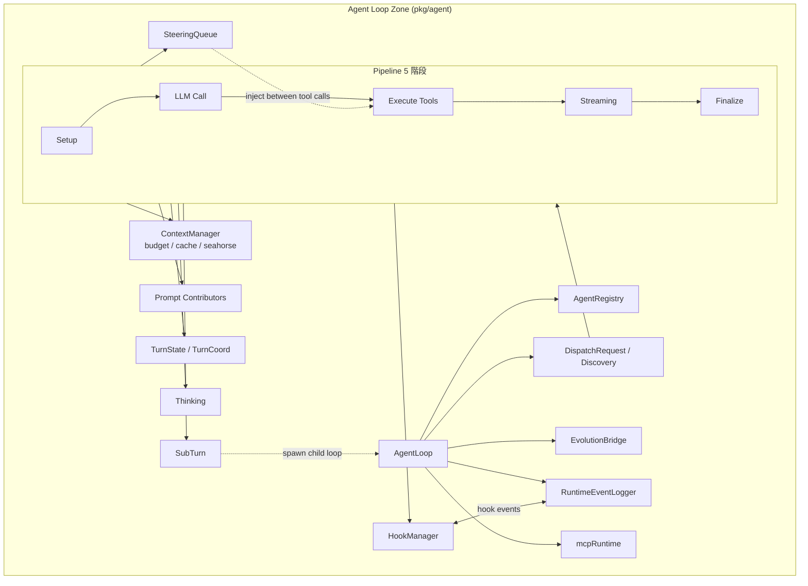

# PicoClaw — 技術脈絡 (Technical Context)

## 專案結構 (Project Structure)

```txt
.
├── assets                # 靜態資源 (架構圖、圖示等)
├── cmd                   # 進入點
│   ├── membench          # 記憶體基準測試程式
│   └── picoclaw          # CLI 主程式
├── config                # 設定檔範本
├── docker                # Dockerfile 與 docker-compose 檔案
├── docs                  # 架構、指南、安全等說明文件
├── examples              # 範例伺源碼
├── pkg                   # 核心邏輯
│   ├── agent             # Agent Loop 與對話 Pipeline 實作
│   ├── audio             # 語音轉文字 (ASR) 與合成 (TTS)
│   ├── auth              # 認證與登入
│   ├── bus               # MessageBus (解耦通道與 Agent)
│   ├── channels          # 多平台對話通道 (Telegram, WeCom 等)
│   ├── config            # 全域與局部配置
│   ├── constants         # 全域常數
│   ├── cron              # 定時任務排程器
│   ├── events            # 內部 Runtime 事件總線
│   ├── evolution         # 自自我學習與代碼打補丁
│   ├── gateway           # 網關 HTTP 與長連接管理器
│   ├── logger            # 日誌工具
│   ├── mcp               # Model Context Protocol 管理器
│   ├── media             # 多媒體與 base64 image 處理
│   ├── providers         # 各 LLM 提供商 (OpenAI, Anthropic 等)
│   ├── routing           # 模型與代理路由
│   ├── seahorse          # FTS 搜尋與歷史壓縮
│   ├── session           # 會話狀態管理
│   ├── skills            # 技能 load 與 installer
│   ├── state             # 狀態管理器
│   ├── tokenizer         # Token 估算器
│   ├── tools             # 各種 Agent 工具 (fs, shell 等)
│   └── utils             # 通用小工具 (http, markdown 等)
├── scripts               # 建置與發布輔助指令
└── web                   # 網頁端啟動器
```

## 技術棧 (Tech Stack)

- 核心語言：`Go 1.25+`, `TypeScript / JavaScript` (前端)
- 前端框架：`React / Svelte` 與 `pnpm` 包管理器
- 建置工具：`Makefile`, `GoReleaser`
- 關鍵依賴：`github.com/spf13/cobra` (CLI 工具架構)、`github.com/creack/pty` (虛擬終端)

## 關鍵決策 (Key Decisions)

- `Bus 解耦 + Pipeline 處理`：`pkg/bus` 扮演 Inbound/Outbound 的訊息中樞，Channels 與 Agent 均只依賴 MessageBus 介面，藉此達成平台與代理的完全解耦。
- `五階段對話管線 (Pipeline)`：一個回合 (turn) 的工作在 `pipeline.go` 及其各子階段（Setup, LLM, Execute, Streaming, Finalize）中被明確拆分與維護。
- `基於 token-budget 的歷史壓縮`：使用 ContextManager (如 seahorse) 在達到 token 上限時進行壓縮，以維持超低記憶體使用量與高效率。
- `Smart Routing 模型分流`：評估使用者請求複雜度分流，降低 API 推理成本。
- `Runtime Event 與 Message Bus 隔離`：運維監控/Hook 事件 (pkg/events) 與用戶對話 I/O 訊息 (pkg/bus) 獨立運作，避免 Hooks/Steering 干擾對話。

### Agent Loop 關係圖



## 模組對應 (Module Mapping)

| 業務領域 (Domain) | 套件/模組 (Package/Module) | 進入點 (Entry Point) |
| --- | --- | --- |
| 多平台對話通道與網關 | `pkg/channels/`, `pkg/gateway/` | `gateway.NewGatewayCommand()` / `Manager.PublishInbound()` |
| 智能代理循環與管線執行 | `pkg/agent/` | `AgentLoop.Run()` / `Pipeline.Execute()` |
| 動態路由與多模態推理 | `pkg/routing/`, `pkg/providers/` | `Router.Route()` / `LLMProvider.Call()` |
| 擴充工具、協定與自我進化 | `pkg/tools/`, `pkg/mcp/`, `pkg/evolution/` | `Registry.Invoke()` / `mcpRuntime.Initialize()` |
| 會話狀態與持久化 | `pkg/session/`, `pkg/memory/` | `session.Manager.Get()` / `store.Save()` |

## 開發指南 (Development Guide)

### 前置需求 (Prerequisites)

- Go 1.25+
- Node.js 22+ 及 pnpm 10.33.0+ (用於網頁 Launcher 前端建置)

### 安裝 (Installation)

```bash
# 下載 Go 依賴
make deps
# 安裝前端依賴
(cd web/frontend && pnpm install --frozen-lockfile)
```

### 建置 (Build)

```bash
# 建置當前平台 picoclaw 主程式
make build
# 建置網頁端啟動器 picoclaw-launcher
make build-launcher
# 建置所有 Makefile 支援之平台
make build-all
```

### 測試 (Test)

```bash
# 執行所有 Go 單元測試與前端測試
make test
# 執行基於 Docker 的整合測試
make integration-test
```

### 部署 (Deploy)

本專案未偵測到特定的雲端部署設定，但支援以下本地或 Docker 部署方式：
- 本地安裝：`make install` 將 picoclaw 安裝至 `~/.local/bin`。
- Docker 部署：`make docker-build` 建置映像檔，`make docker-run` 啟動 gateway。

## 慣例 (Conventions)

- 檔案命名：測試檔案統一以 `_test.go` 結尾，功能模組依據職責區分包結構。敏感憑證如 API 金鑰自 `config.json` 剝離至 `.security.yml`。
- 錯誤處理：採用 Go 標準 `error` 傳遞與多重回退鏈 (Fallback Chain) 設計，`maybePublishError` 統一捕獲 turn 執行中的異常並寫入 Bus。
- 日誌記錄：統一使用 `pkg/logger` 提供結構化日誌輸出，以 debug, info, warn, error 控制輸出層級。
- 單元測試：全面使用 `github.com/stretchr/testify/assert` 進行狀態斷言與 mock 測試。

## 變更紀錄 (Changelog)

### 2026-06-20 — 倉庫下移為 submodule + agent 編排層抽離

- 本 repo 下移一層,成為 `m-agent` superproject 的 git submodule(路徑 `picoclaw/`)。本 repo 自身內容不變,僅在外層多一層分發/代理層。
- remote 改名(fork 慣例):`origin`(原 sipeed)→ `upstream`(追上游用);`bizshuk`(你的 fork)→ `origin`(push 用)。
- 編排/測試/資料等 customized 資產上移到 m-agent,本 repo 移除:`docker/docker-compose.agent.yml`、`docker/docker-compose.app.yml`、`docker/entrypoint-agent.sh`、`docker/README.md`、`scripts/a2a-test/`、`agents/`(原即 gitignored)。
- 分界判準:`gateway` / `launcher` / `agent` 的 build 定義(`docker/Dockerfile.*`)與 Go source 屬引擎 code logic → 留本 repo;部署編排(compose / entrypoint)、測試 harness、agent 資料 → 上移 m-agent。m-agent 的 compose 以 `context: ../picoclaw` 引用本 repo 做 build。

### 2026-06-19 — A2A 跨 agent + Docker MiniMax agent

- `pkg/channels/a2a/`：新增 A2A channel(mDNS 廣播/探索、WS peer 協定、`POST /a2a/v1/ask` 同步 HTTP 入口)。
- `gateway.go`：blank-import `channels/a2a` 註冊 factory(否則 channel 不啟動)。
- `discovery.go`：mDNS 改傳明確 hostname + primary outbound IP(修「裸IP hostname 起不來」與「廣播到虛擬網卡」)。
- `a2a.go` + `session_route.go`:`sessionRouteTable`(key=ChatID)讓回覆 outbound 補回遺失的 a2a 路由 context;janitor goroutine TTL 1 天 + 回覆送出即 evict。
- `registry.go` + `config.go`:subagent spawn 政策改 `預設允許 / 明列 deny`(新增 `subagents.deny_agents`)。agent approval 機制待辦見 `docs/backlog.md`。
- providers:新增 `minimax-i18n`(國際站 `api.minimax.io`),與既有 `minimax`(中國站 `minimaxi.com`)並存,用 model_name 區分。
- `cmd/picoclaw-envcfg`:用 `gosdk/config.Default()` 載 `.env`,啟動時把金鑰注入 config(`model_list.api_keys` 無 env binding)。
- Docker:`docker/Dockerfile.appbase`、`docker/docker-compose.agent.yml`(統一長駐 agent;YAML anchor + 多 service,內建 `alice:` / `bob:` 雙 agent 測試)、`docker/entrypoint-agent.sh`(取代 `entrypoint-a2a.sh`)。`agents/<name>/` 為 host 端自我包含資料夾(各為獨立 git repo),bind-mount 進容器;`config.a2a.json` / `config.app.json` / `docker-compose.a2a.yml` / `docker-compose.app.yml` 已廢除,各自 config 下沉到 `agents/<name>/config.json`。
- 驗證:Test 1(雙向 mDNS 互相發現)、Test 2(alice 經 spawn 叫 bob 回 `ECHO-7Q2`,HTTP caller 收到)皆 PASS。
