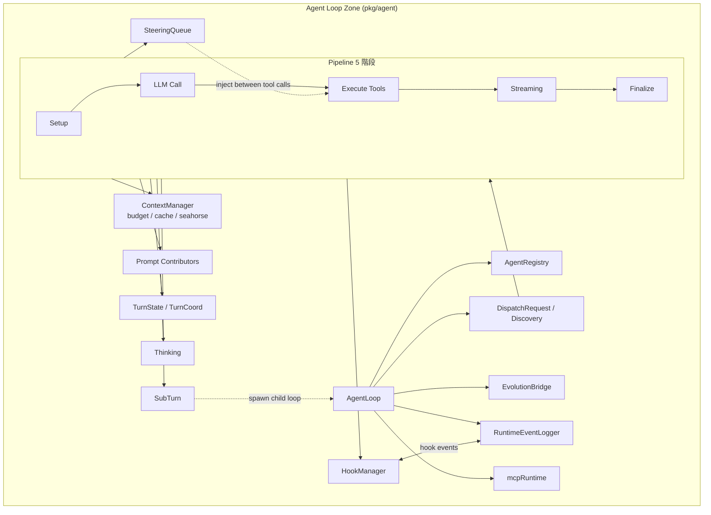
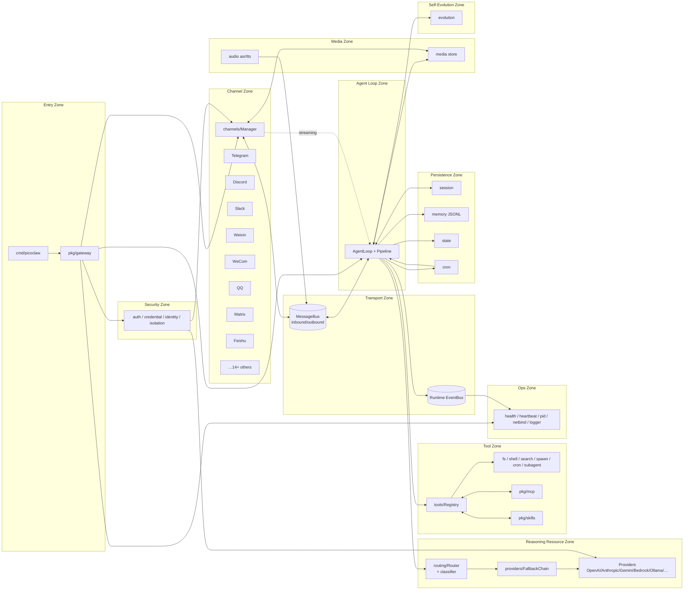

# Picoclaw

我已掃描 `pkg/` 目錄結構、`pkg/agent/`、`pkg/gateway/`、`pkg/channels/`、`pkg/tools/`、`pkg/bus/`，並交叉比對 `docs/architecture/` 文件。以下是 PicoClaw 的架構整理。

```txt
★ Insight ─────────────────────────────────────
1. PicoClaw 採「Bus 解耦 + Pipeline 處理」模式：`pkg/bus` 是 inbound/outbound 訊息的中樞，Channels 與 AgentLoop 都只依賴 Bus 介面 (interfaces.MessageBus / StreamDelegate)，因此新增 channel 不需修改 agent，新增 agent 也不需修改 channel。
2. `pkg/agent/agent.go` 的 `AgentLoop` 是整個 runtime 的協調者，但實際每輪 (turn) 的工作被切到 `pipeline_setup.go → pipeline_llm.go → pipeline_execute.go → pipeline_streaming.go → pipeline_finalize.go` 五個階段，呼應 NanoBot 風格的 "agentic loop"。
3. `pkg/events` (runtime events) 與 `pkg/bus` (訊息) 是兩條獨立通道：前者是觀察/日誌/Hook 的事件總線 (內部監測)，後者是 user-facing 訊息 (外部 I/O)，這個分離讓 Hooks/Steering/Evolution 不會污染 channel 流量。
─────────────────────────────────────────────────
```

# Component Zones (網域分區)

- Entry Zone (入口層)
    - `cmd/picoclaw` — CLI 主程式 (onboard, agent, gateway, mcp, cron, skills)
    - `cmd/membench` — 記憶體 benchmark
    - `pkg/gateway` — 啟動 Gateway HTTP 伺服器與所有子服務的 supervisor
- Channel Zone (對話通道層)
    - `pkg/channels/{telegram, discord, slack, slack_webhook, teams_webhook, weixin, wecom, qq, matrix, feishu, line, dingtalk, irc, mqtt, onebot, vk, whatsapp, whatsapp_native, maixcam, pico}`
    - `pkg/channels/manager.go` — 動態註冊 / mux / rate limit / typing 狀態
- Transport Zone (傳輸與事件層)
    - `pkg/bus` — MessageBus (inbound, outbound, outboundMedia, audioChunks, voiceControls) + Streamer 介面
    - `pkg/events` — Runtime Events Bus (Hook/observer 用)
- Agent Loop Zone (核心循環) 詳見下節
- Reasoning Resource Zone (推理資源層)
    - `pkg/providers/{openai_compat, anthropic, anthropic_messages, azure, bedrock, oauth, cli, httpapi}` 等
    - `pkg/providers/fallback.go`, `cooldown.go`, `ratelimiter.go`, `factory.go` — fallback chain / 多 key / 限流
    - `pkg/routing` — model & agent 路由 (router, classifier, features)
- Tool Zone (工具層)
    - `pkg/tools/fs` (read/write/glob…), `shell`, `search_tool`, `spawn`, `subagent`, `delegate`, `cron`, `integration`, `hardware`, `shared`
    - `pkg/tools/registry.go` — Tool registry + allowlist
    - `pkg/mcp` — MCP server manager (stdio/SSE/HTTP)
    - `pkg/skills` — SKILL.md loader、ClawHub/GitHub 註冊庫、installer
- Persistence Zone (持久化層)
    - `pkg/session` — Session manager + allocator + JSONL backend
    - `pkg/memory` — JSONL memory store
    - `pkg/state` — runtime state.Manager
    - `pkg/cron` — 定時任務排程
- Media Zone (多模態層)
    - `pkg/media` — MediaStore (vision pipeline base64)
    - `pkg/audio` (asr/tts) — 語音轉錄與合成
- Identity & Security Zone
    - `pkg/auth`, `pkg/credential`, `pkg/identity`, `pkg/isolation`
- Ops Zone (運維層)
    - `pkg/health`, `pkg/heartbeat`, `pkg/pid`, `pkg/netbind`, `pkg/logger`, `pkg/updater`
- Self-Evolution Zone
    - `pkg/evolution` + `pkg/agent/evolution_bridge.go` — 自我學習 / draft / apply
- Misc Foundations
    - `pkg/config`, `pkg/constants`, `pkg/tokenizer`, `pkg/utils`, `pkg/fileutil`, `pkg/migrate`, `pkg/seahorse`

# Agent Loop Zone — 核心元件

| 元件                          | 檔案                                                                                 | 角色                                                                                       |
| ----------------------------- | ------------------------------------------------------------------------------------ | ------------------------------------------------------------------------------------------ |
| `AgentLoop`                   | `pkg/agent/agent.go`                                                                 | 整個 turn 的協調者；持有 bus、registry、hooks、steering、mcp、evolution、provider fallback |
| `AgentRegistry`               | `registry.go`                                                                        | 多 agent 定義註冊；支援子代理                                                              |
| `Pipeline`                    | `pipeline.go` + `pipeline_setup/llm/execute/streaming/finalize.go`                   | 一輪對話的五階段執行管線                                                                   |
| `ContextManager`              | `context_manager.go`, `context_budget.go`, `context_cache.go`, `context_seahorse.go` | 歷史壓縮 / token budget / 快取                                                             |
| `TurnState` / `TurnCoord`     | `turn_state.go`, `turn_coord.go`, `turn_profile_policy.go`                           | 單輪可變狀態與排程 (per-session lock)                                                      |
| `HookManager`                 | `hooks.go`, `hook_mount.go`, `hook_process.go`                                       | observers / interceptors / approval hooks                                                  |
| `SteeringQueue`               | `steering.go`                                                                        | 在工具呼叫之間注入訊息                                                                     |
| `SubTurn`                     | `subturn.go`                                                                         | 子代理並發控制與生命週期                                                                   |
| `EvolutionBridge`             | `evolution_bridge.go`                                                                | 連接 `pkg/evolution` 自我學習                                                              |
| `RuntimeEventLogger`          | `runtime_event_logger.go`, `events_runtime.go`                                       | 將 runtime events 寫到日誌                                                                 |
| `mcpRuntime`                  | `agent_mcp.go`                                                                       | 把 MCP 工具動態載入 ToolRegistry                                                           |
| `DispatchRequest`             | `dispatch_request.go`, `discovery.go`                                                | 路由解析後的 turn 邊界                                                                     |
| `Prompt / PromptContributors` | `prompt.go`, `prompt_contributors.go`, `prompt_turn.go`                              | system prompt 組裝 (skills / memory / context)                                             |
| `Thinking`                    | `thinking.go`                                                                        | extended thinking 處理                                                                     |

# Zone 內部關係 — Agent Loop



# Zone 之間整體關係



# 整體關聯 — 最小化關係表

| 來源 Zone  | 關係                                 | 目標 Zone                               |
| ---------- | ------------------------------------ | --------------------------------------- |
| Entry      | bootstraps                           | Channel, Agent Loop, Ops, Security      |
| Channel    | publish inbound / subscribe outbound | Transport                               |
| Transport  | delivers turns                       | Agent Loop                              |
| Agent Loop | calls models via                     | Reasoning Resource                      |
| Agent Loop | invokes                              | Tool Zone                               |
| Tool Zone  | extends with                         | MCP, Skills                             |
| Agent Loop | reads/writes                         | Persistence (session/memory/state/cron) |
| Agent Loop | attaches/decodes                     | Media                                   |
| Agent Loop | emits                                | Runtime Events (Ops 訂閱)               |
| Agent Loop | learn / apply                        | Self-Evolution                          |
| Security   | gates credentials for                | Reasoning Resource, Channel             |
| Ops        | observes                             | 全 zone                                 |

```txt
★ Insight ─────────────────────────────────────
- 「Channel ↔ Agent」是「弱耦合 via Bus」；「Agent ↔ Tools」是「強耦合 via Registry」——這就是為什麼新增 channel 容易、新增 tool 也容易，但更動 turn 流程 (例如插入 steering) 必須改 pipeline 本身。
- `pkg/routing` 處於 Agent Loop 與 Providers 之間，負責「light/heavy 模型分流」(README 中提到的 smart routing)——它讓便宜模型先回答簡單問題，所以這層其實是成本最佳化的關鍵節點。
- `pkg/mcp` 在 zone 圖上看似獨立，實際是 ToolRegistry 的「動態 plugin 源」——MCP server 啟動時把它的 tools 注入 registry，與內建 tools 共用同一條 execute pipeline。
─────────────────────────────────────────────────
```

需要我針對某個 zone (例如 Pipeline 五階段、或 Channel Manager 的 dynamic mux) 再展開更深層的圖嗎？
