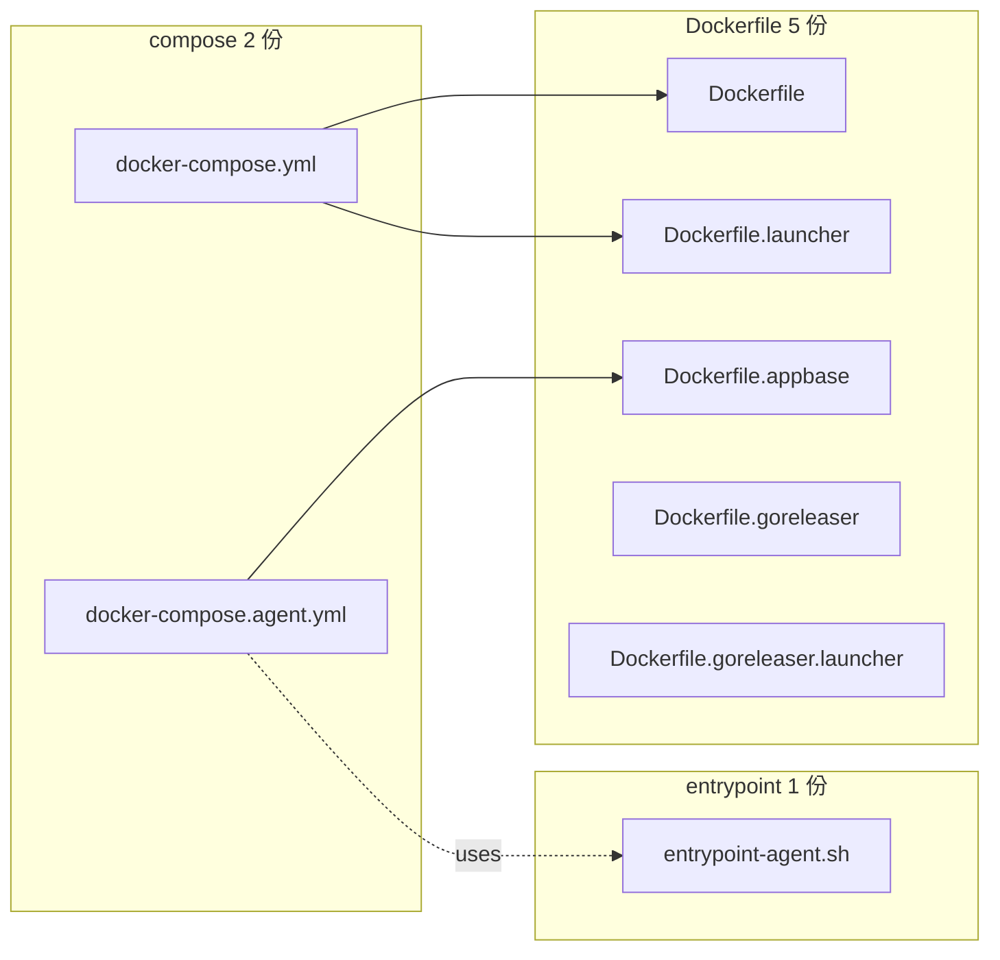

# docker/ — 容器化資產總覽

容器化所有資產(Dockerfile / compose / entrypoint script)集中在 `docker/`,對應不同的部署情境(local CLI / long-running daemon / LAN networked agent / app-workspace mode)。

## 結論

- 2 份 compose(本機 local dev + 統一長駐 agent)
- 5 份 Dockerfile(對應不同映像層選擇)
- 1 份 entrypoint(`entrypoint-agent.sh`,通用)
- 每個 long-running agent 是 host 上一個 `agents/<name>/` 資料夾(獨立 git repo),bind-mount 進容器
- **無 Docker named volume** — down 之後資料夾就只是 host 上一個普通資料夾

## 目錄結構

```txt
docker/
├── Dockerfile                       基礎 — 只 build picoclaw binary
├── Dockerfile.appbase               3-stage — 含 frontend / Go+Node+Python toolchain
├── Dockerfile.launcher              webui + gateway 同一 image
├── Dockerfile.goreleaser            release 用
├── Dockerfile.goreleaser.launcher   release — launcher 變體
├── docker-compose.yml               本機 local dev:agent / gateway / launcher 三 profile
├── docker-compose.agent.yml         統一長駐 agent(alice / bob 共用,YAML anchor + 多 service)
└── entrypoint-agent.sh              通用入口;載 .env + 渲染 config.active.json + exec launcher
```

## Compose 對照

| 檔案 | service 數 | profile | Dockerfile | network | 暴露 port | 主要用途 |
| --- | --- | --- | --- | --- | --- | --- |
| `docker-compose.yml` | 3 | `agent` / `gateway` / `launcher` | `Dockerfile` / `Dockerfile.launcher` | bridge(預設) | `18800` + `18790`(僅 launcher) | 本機 local dev / CLI |
| `docker-compose.agent.yml` | 2(可加) | — | `Dockerfile.appbase` | `host` / `service:alice` | (用 host networking) | LAN / 同機 long-running agent(可加 service block 擴充) |

## Dockerfile 對照

| 檔案 | FROM | 內含 binary | 內含 toolchain | 用於哪個 compose |
| --- | --- | --- | --- | --- |
| `Dockerfile` | `golang:1.25-alpine` | `picoclaw` | 最小 | `docker-compose.yml` (agent / gateway) |
| `Dockerfile.appbase` | 3-stage: `node:24-alpine3.23` → `golang:1.25-bookworm` → `golang:1.25-bookworm` | `picoclaw` + `picoclaw-launcher` + `picoclaw-envcfg` | Node + pnpm + Python + uv | `docker-compose.agent.yml` |
| `Dockerfile.launcher` | `node:24-alpine3.23` | `picoclaw-launcher` | Node + pnpm(frontend build) | `docker-compose.yml` (launcher profile) |
| `Dockerfile.goreleaser` | `alpine:3.21` | (release artifact) | (release) | CI / release |
| `Dockerfile.goreleaser.launcher` | `alpine:3.21` | (release artifact) | (release) | CI / release |

## Entrypoint

| 檔案 | 何時執行 | 動作 |
| --- | --- | --- |
| `entrypoint-agent.sh` | `docker-compose.agent.yml` 全部 service | 1. 讀 `config.json` (template) + `.env`  2. `picoclaw-envcfg` 渲染到 `config.active.json`  3. `exec picoclaw-launcher` |

## 元件關係圖



## 加一個新 agent(alice → bob 模式延伸為 alice + bob + charlie)

在 `docker-compose.agent.yml` 內加 service block + `mkdir agents/charlie` + 從 `agents/alice` 複製 config 改欄位:

```yaml
charlie:
  <<: *agent-default
  container_name: charlie-a2a
  network_mode: "service:alice"
  depends_on:
    alice:
      condition: service_healthy
  environment:
    - GATEWAY_PORT=38790
    - A2A_PORT=38791
  volumes:
    - ./entrypoint-agent.sh:/opt/picoclaw/entrypoint-agent.sh:ro
    - ./agents/charlie:/root/.picoclaw
```

## 計畫連結

- `../plans/2026-06-19-docker-a2a-pair-harness.md` — SUPERSEDED
- `../plans/2026-06-19-docker-agent-unification.md` — 主要重構計畫
- `../docs/docker-a2a-agent.md` — A2A 統一 agent 使用指南
- `../docs/a2a-two-agent-test.md` — 雙 agent 測試規格
- `../agents/README.md` — `agents/<name>/` 資料夾 convention

## 決策矩陣

| 需求 | 用哪個 |
| --- | --- |
| 本機用 CLI 問一次 | `docker-compose.yml` 的 `agent` profile |
| 本機跑常駐 gateway(基本) | `docker-compose.yml` 的 `gateway` profile |
| 本機跑 webui + gateway | `docker-compose.yml` 的 `launcher` profile |
| 跑 LAN / 同機 long-running agent | `docker-compose.agent.yml`(編輯 service block 加 agent) |
| 跑雙 agent 測試(alice + bob) | `docker-compose.agent.yml`(預設就有 alice / bob) |
