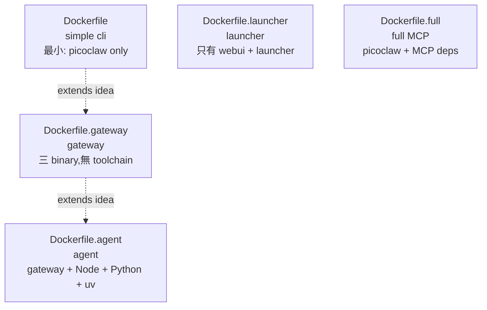
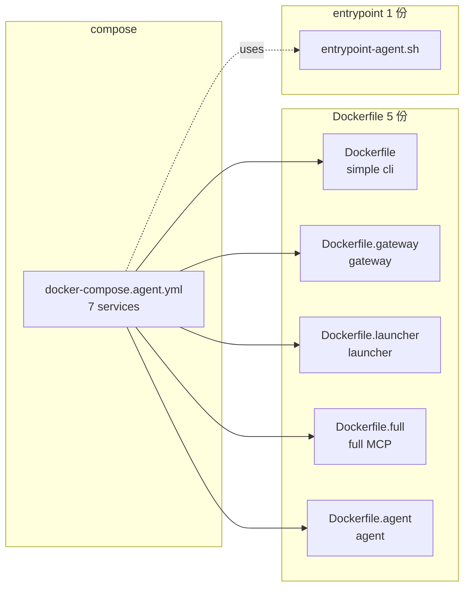

# docker/ — 容器化資產總覽

容器化所有資產(Dockerfile / compose / entrypoint script)集中在 `docker/`,對應不同的部署情境。

## 結論

- **1 份 compose**(`docker-compose.agent.yml`)+ 7 個 service,user 透過 **profile** 或 **service name** 決定啟動哪些
- **5 份 Dockerfile**(對應 5 種用途 — simple cli / gateway / launcher / full / agent)
- **1 份 entrypoint**(`entrypoint-agent.sh`,通用)
- 每個 long-running agent 是 host 上一個 `agents/<name>/` 資料夾(獨立 git repo),bind-mount 進容器
- **無 Docker named volume** — down 之後資料夾就只是 host 上一個普通資料夾

## 5 份 Dockerfile(對應 5 種用途)

| 用途 | 檔案 | 內含 binary | Runtime | 用途場景 |
| --- | --- | --- | --- | --- |
| **simple cli** | `Dockerfile` | `picoclaw` | `golang:1.25-alpine` | `picoclaw-agent`(一次性 CLI 查詢) |
| **gateway** | `Dockerfile.gateway` | `picoclaw` + `picoclaw-launcher` + `picoclaw-envcfg` | `alpine:3.23`(無 toolchain) | `picoclaw-gateway`(本機常駐 daemon) |
| **launcher** | `Dockerfile.launcher` | `picoclaw-launcher`(含 webui) | `alpine:3.23` | `picoclaw-launcher`(web console) |
| **full** | `Dockerfile.full` | `picoclaw` + full MCP deps | `node:24-alpine3.23` + Python + uv | `picoclaw-agent-full` / `picoclaw-gateway-full`(MCP-heavy) |
| **agent** | `Dockerfile.agent`(原 `Dockerfile.appbase`) | `picoclaw` + `picoclaw-launcher` + `picoclaw-envcfg` | `golang:1.25-bookworm` + Node + Python + uv | A2A `alice` / `bob`(給 agent 跑 app 用的完整 toolchain) |

> (另有 `Dockerfile.goreleaser` / `Dockerfile.goreleaser.launcher` 給 CI / release pipeline 用,不在開發流程範圍。)

### 設計意圖(分層)



`agent` = `gateway` + toolchain;`gateway` = `simple cli` + launcher + envcfg;`launcher` 是獨立的 webui-only 分支;`full` 是平行分支(只換 MCP deps)。

## 1 份 compose + 7 services

```txt
docker-compose.agent.yml
├── services:
│   ├── alice           (profile: a2a, alice)         Dockerfile.agent
│   ├── bob             (profile: a2a, bob)           Dockerfile.agent
│   ├── picoclaw-agent      (profile: local, cli)        Dockerfile
│   ├── picoclaw-gateway    (profile: local, gateway)    Dockerfile.gateway
│   ├── picoclaw-launcher   (profile: local, launcher)   Dockerfile.launcher
│   ├── picoclaw-agent-full (profile: full-mcp, cli)     Dockerfile.full
│   └── picoclaw-gateway-full (profile: full-mcp, gateway) Dockerfile.full
```

| 用途 | 用哪個 profile |
| --- | --- |
| 跑 A2A 雙 agent 測試(alice + bob) | `--profile a2a` |
| 跑本機常駐 gateway + webui | `--profile local` |
| 跑 full-MCP 變體 | `--profile full-mcp` |
| 跑單一 service(繞過 profile) | `up -d <service-name>` |
| 停單一 service | `down <service-name>` |

## 目錄結構

```txt
docker/
├── Dockerfile                       simple cli
├── Dockerfile.gateway               gateway(三 binary,無 toolchain)
├── Dockerfile.launcher              webui + launcher
├── Dockerfile.full                  full MCP variant
├── Dockerfile.agent                 agent(gateway + toolchain)
├── Dockerfile.goreleaser            release
├── Dockerfile.goreleaser.launcher   release — launcher 變體
├── docker-compose.yml               (legacy — 被 agent.yml 取代,待刪)
├── docker-compose.agent.yml         統一長駐 agent 入口(7 services)
└── entrypoint-agent.sh              通用入口
```

## 元件關係圖



## 加一個新 A2A agent(alice → bob 模式延伸)

在 `docker-compose.agent.yml` 內加 service block + `mkdir agents/charlie` + 從 `agents/alice` 複製 config 改欄位:

```yaml
charlie:
  <<: *agent-default
  image: picoclaw-appbase:dev
  build:
    context: ..
    dockerfile: docker/Dockerfile.agent
  container_name: charlie-a2a
  network_mode: "service:alice"
  profiles: [a2a, charlie]
  depends_on:
    alice:
      condition: service_healthy
  environment:
    - PICOCLAW_GATEWAY_HOST=0.0.0.0
    - PICOCLAW_CONFIG_DIR=/root/.picoclaw
    - GATEWAY_PORT=38790
    - A2A_PORT=38791
  volumes:
    - ./entrypoint-agent.sh:/opt/picoclaw/entrypoint-agent.sh:ro
    - ./agents/charlie:/root/.picoclaw
```

## 計畫連結

- `../plans/2026-06-19-docker-a2a-pair-harness.md` — SUPERSEDED
- `../plans/2026-06-19-docker-agent-unification.md` — 主要重構計畫
- `../docs/docker-a2a-agent.md` — A2A 統一 agent 使用指南
- `../docs/a2a-two-agent-test.md` — 雙 agent 測試規格
- `../agents/README.md` — `agents/<name>/` 資料夾 convention
