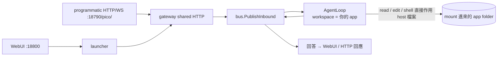

# Docker App-Workspace Agent — 設計 (Design)

日期 (Date): 2026-06-17
狀態 (Status): Approved — 待 implementation plan
方案 (Approach): A (mount 即 workspace)

## 目標 (Goal)

打包一個 Docker 容器,把使用者的「應用程式原始碼資料夾」在執行時 mount 進去當作 agent 的
base (workspace)。當請求打到 `gateway` 或 `webui` 時,agent 以該資料夾的內容為依據,
透過讀 / 寫 / 執行來回答。

關鍵需求 (Requirements):

- folder 角色:應用程式原始碼 (treated as a codebase)。
- 存取權限:完整 — `read` + `write` + `execute` (shell)。
- 注入時機:執行時 mount (`docker run -v` / compose volume),folder 留在 host。
- 觸發入口:`gateway` (programmatic HTTP/WS) 與 `webui` 皆可。
- runtime:容器內需具備 `Go` + `Node.js` + `Python`,agent 才能 build/test/run 該 app。
- 可觀察性:使用者要能在 host 端即時觀察 agent 改檔 / 跑指令的變化過程。

## 為什麼選方案 A (Why Approach A)

對照過三個方案 (見文末附錄)。使用者選 A 的核心理由:agent 的每次 `read` / `edit` /
`shell` 都直接作用在 host 上 mount 進來的檔案,因此在 host 開編輯器或 `git diff` 就能
即時看到變化過程 — 這是方案 A 獨有的可觀察性。

方案 A 的已知代價:picoclaw 把 sessions 寫進 `workspace/sessions`
(`pkg/agent/instance.go:129`),所以使用者的 repo 內會長出 `sessions/`。交付物會附一行
提示把 `sessions/` 加進該 repo 的 `.gitignore`。乾淨隔離的版本以方案 B 留待之後
(寫入 `docs/backlog.md`)。

## 架構決策依據 (Codebase Facts)

設計建立在以下已驗證的程式碼事實上:

| 事實 (Fact) | 位置 (Location) | 對設計的影響 |
| --- | --- | --- |
| sessions 寫進 `workspace/sessions` | `pkg/agent/instance.go:129` | mount app 當 workspace 會產生 `sessions/`,需 `.gitignore` |
| shell cwd 鎖在 workspace,可由 allowedPath 放行 | `pkg/tools/shell.go:358,368` | 方案 A 下 app 即 workspace,shell 天然在 app 根目錄 |
| 預設 gateway host 為 `localhost` | `pkg/config/defaults.go:301` | 容器須設 `PICOCLAW_GATEWAY_HOST=0.0.0.0` 否則外部連不進 |
| gateway shared HTTP server 掛 channel webhook | `pkg/channels/manager.go:1084,1125` | programmatic 觸發走 channel 的 webhook path |
| `pico` channel 掛在 `/pico/` (WebSocket) | `pkg/channels/pico/pico.go:277` | webui 與程式化呼叫的觸發入口 |
| launcher `/api/*` 為控制台非聊天入口 | `web/backend/api/*.go` | 聊天觸發不走 `/api`,走 channel |
| config 已有全工具與安全旗標 | `pkg/config/config.go:380,1021` | 全工具與邊界純 config 即可,不改 Go 程式碼 |

## 系統流程 (System Flow)



## Mount 對應 (Volume Mapping)

```txt
host 端                                容器內
  app 原始碼   ──(-v, rw)──>  /root/.picoclaw/workspace    ← agent 的 fs 根 + cwd
  config.app.json ─(-v, ro)─>  /root/.picoclaw/config.json  ← keys / model / 工具開關
                               /root/.picoclaw/ (其餘)      ← picoclaw 自身狀態
```

- `workspace = /root/.picoclaw/workspace`,被使用者的 app 資料夾覆蓋 → agent 以它為 base。
- `restrict_to_workspace: true` → fs/shell 的安全邊界即該 app 資料夾,agent 跑不出去。
- persona 由 config 注入 (非寫進 repo),維持資料夾乾淨 (除無法避免的 `sessions/`)。

## 元件 (Components)

### 1. `docker/Dockerfile.appbase` (新映像)

多階段 build:

1. frontend build (`pnpm`) → 產生 launcher webui 資產 (沿用 `Dockerfile.launcher` 的 frontend 階段)。
2. Go builder → 編出 `picoclaw` 與 `picoclaw-launcher` 兩個 binary。
3. runtime 基底:含 `Go 1.25` + `Node 24` + `Python3` + `uv`,讓 agent 能對 mount 進來的
   Go / Node / Python app 做 build / test / run。
4. `ENTRYPOINT picoclaw-launcher -console -public -no-browser` → webui 與 gateway 同時啟動。

### 2. `docker/docker-compose.app.yml` (新 compose)

單一 service:

- `build` 指向 `docker/Dockerfile.appbase`。
- volumes:
  - `${APP_DIR:-./app}:/root/.picoclaw/workspace` (app folder 即 workspace,rw)。
  - `./config/config.app.json:/root/.picoclaw/config.json:ro`。
- environment:
  - `PICOCLAW_GATEWAY_HOST=0.0.0.0` (必須,否則外部連不進)。
  - provider API key (例如 `PICOCLAW_...` 對應的金鑰 env)。
  - 選用 `PICOCLAW_LAUNCHER_TOKEN` 固定 dashboard token。
- ports:`18800:18800` (webui)、`18790:18790` (gateway HTTP / `pico` channel)。

### 3. `config/config.app.json` (預設 config)

- `agents.defaults.workspace = /root/.picoclaw/workspace`。
- `agents.defaults.restrict_to_workspace = true`。
- 啟用全工具:`read_file` / `write_file` / `edit_file` / `list_dir` / shell。
- 啟用 `pico` channel (供 webui 與 programmatic 觸發)。
- 注入 persona:說明「你是 mount 在 workspace 的這個 app 的助理,以資料夾內檔案為依據回答,
  必要時可讀寫與執行」。
- 含 model 與 provider 設定 (金鑰走 env,不落地進 config)。

### 4. `docs/backlog.md` (方案 B 待辦)

記錄方案 B:狀態獨立 + `allow_read_paths` / `allow_write_paths` 授權 `/app`,picoclaw 狀態
放獨立 volume,app 資料夾零污染、persona 烤進 image 可跨專案重用。供之後升級用。

### 5. README 用法片段 (Usage)

```bash
APP_DIR=/path/to/your/app docker compose -f docker/docker-compose.app.yml up
# WebUI:    http://localhost:18800
# Gateway:  http://localhost:18790/pico/  (programmatic HTTP/WS 觸發)
```

提示:把 `sessions/` 加進該 app repo 的 `.gitignore` (方案 A 的已知副作用)。

## 範圍外 (Out of Scope)

- 方案 B 的乾淨隔離 (記入 `docs/backlog.md`,本次不實作)。
- 其他語言 runtime (Rust 等);本次僅 Go + Node.js + Python。
- 對 picoclaw Go 程式碼的任何修改 (本設計純靠 Docker + config 達成)。
- 多 app 同時掛載 / 多租戶。

## 驗證 (Verification)

- `docker compose -f docker/docker-compose.app.yml up` 能啟動,webui (18800) 與 gateway (18790) 皆可連。
- 掛一個 Go / Node / Python 範例 app,從 webui 發問,agent 能 `read` 該 app 檔案並回答。
- 請 agent 改一個檔案,確認 host 端檔案即時變動 (可觀察性)。
- 請 agent 跑該 app 的 build / test,確認容器內 toolchain 可用。
- programmatic:對 `:18790/pico/` 發訊息能觸發同一 agent。

## 附錄:方案對照 (Appendix: Approach Comparison)

| 方案 | workspace 指向 | app folder 放哪 | 狀態污染 | persona |
| --- | --- | --- | --- | --- |
| A (採用) | `/app` (= mount) | 就是 workspace 本身 | sessions 寫進 repo | config 注入 |
| B (backlog) | image 內 volume | mount `/app` 並加進 allow_read/write_paths | 無 | image 內固定,可重用 |
| C (淘汰) | image volume + 啟動時 symlink | mount `/app` | 視 link 策略 | image 內 |

C 淘汰原因:symlink 在 shell cwd 鎖定 + 逃逸判定下易有相對路徑坑,複雜度不值得。
