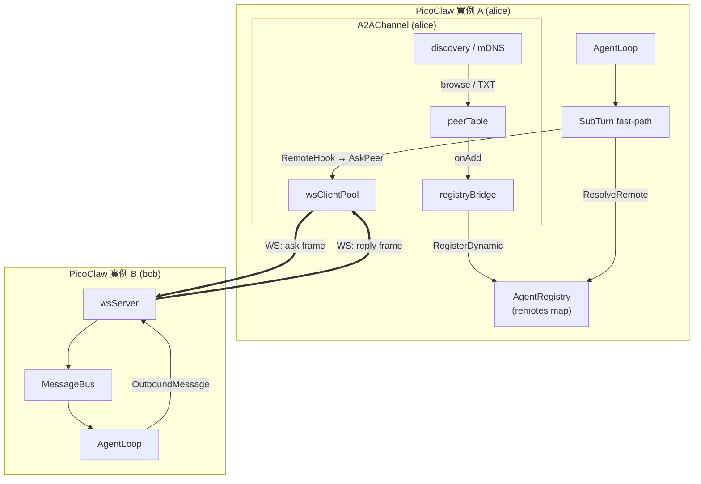
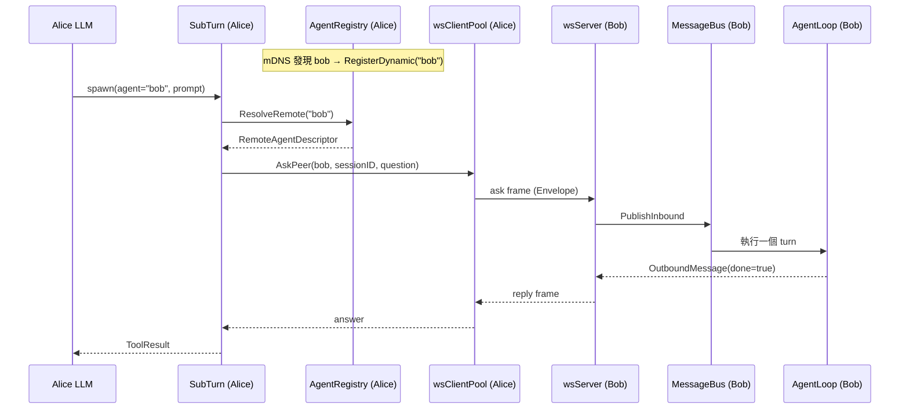

# 擴充能力導覽:代理間通訊 (A2A Extended Capability)

本教學介紹這次新增的擴充能力 (Extended Capability):讓單一 PicoClaw 實例能在區域網路上`自動發現`其他 PicoClaw 實例,並把它們當成`虛擬子代理 (virtual sub-agent)`直接 `spawn` 呼叫。整個能力以全新的 `a2a` 通道 (Channel) 實作,核心程式碼位於 `pkg/channels/a2a/`,並對 `pkg/agent`、`pkg/config`、`pkg/gateway`、`pkg/events` 做了少量整合性修改。

## 一句話總結 (TL;DR)

- 一個代理 (Agent) 可以像呼叫本地子代理一樣,呼叫`另一台機器上`的代理。
- 對 LLM 完全透明:用同一個 `spawn` 工具,差別只在目標 `agent_id` 解析到的是遠端對等節點 (Peer)。
- 傳輸層採 `WebSocket`,發現層採 `mDNS`,並用`回合上限 (max turn)` 防止代理之間無限互問。

## 為什麼需要 (Motivation)

PicoClaw 既有架構已經透過 `pkg/bus` (MessageBus) 做到`通道`與`代理`的解耦,也支援`本地`子代理 (Local Sub-Turn) 的派生。但跨`進程 (process)`、跨`主機 (host)` 的代理協作一直缺席。A2A 補上這一塊,並刻意沿用既有抽象,使得:

- 跨機器協作不需要中央伺服器,靠 `mDNS` 在區域網內零設定互相發現。
- 遠端代理`偽裝`成本地子代理,既有的 `spawn` 工具、深度限制、併發訊號量都能直接複用。
- 對話 I/O 仍走 `MessageBus`,運維事件仍走 `pkg/events`,維持原有的隔離設計。

## 整體架構 (Architecture)

兩台實例 (alice 與 bob) 互為對等節點。每台同時是`伺服器 (server)` 也是`客戶端 (client)`。



## 核心元件 (Core Components)

| 元件 (Component) | 檔案 (File) | 職責 (Responsibility) |
| --- | --- | --- |
| `A2AChannel` | `a2a.go` | 通道進入點;組合 server / client / discovery,實作 `Start` / `Stop` / `Send` |
| `wsServer` | `server.go` | 接收對方的 `ask`,發布到 `MessageBus`,回送 `reply` |
| `wsClientPool` | `client.go` | 連線池;對外撥接 (dial)、重用連線、閒置回收 (idle reap) |
| `AskPeer` + `pendingMap` | `ask_client.go` | 同步 RPC:送出 `ask`、登記等待者、阻塞等 `reply` |
| `discovery` | `discovery.go` | `mDNS` 公告 (announce) 與瀏覽 (browse) 對等節點 |
| `peerTable` | `peer_table.go` | 已知對等節點表;TTL 過期清除 (reap),觸發 `onAdd` / `onRemove` |
| `registryBridge` | `bridge.go` | 把對等節點橋接成 `AgentRegistry` 的虛擬代理 |
| `turnCounter` | `turn_counter.go` | 每個 session 的回合計數與結束標記,防無限循環 |
| `sessionMap` | `session_map.go` | 外部 `session_id` 與本地 `session_key` 的雙向映射 |
| `Envelope` + 協定 | `protocol.go` | 線上幀格式 (wire frame) 與解析 |

## 端到端流程 (End-to-End Flow)

以 alice 的 LLM 想詢問 bob 為例:



關鍵設計:遠端呼叫對 LLM `透明`。LLM 只是用既有的 `spawn` 工具指定一個 `agent_id`,`spawnSubTurn` 在 `pkg/agent/subturn.go` 內以一段`快速路徑 (fast-path)` 判斷該 ID 是否為遠端對等節點,若是就改走 `RemoteHook`,否則維持原本的本地派生邏輯。

## 通訊協定 (Protocol)

所有資料都包在 `Envelope` 內,子協定 (subprotocol) 名稱固定為 `picoclaw-a2a.v1`,版本號 `v=1`。

```jsonc
{
  "v": 1,
  "type": "ask",
  "frame_id": "uuid",
  "in_reply_to": "uuid",   // reply / error 才有
  "session_id": "uuid",
  "from": "alice",
  "to": "bob",
  "ts": 1718000000,
  "payload": { /* 依 type 而定 */ }
}
```

幀型別 (Frame Type) 與用途:

| `type` | 方向 (Direction) | Payload | 用途 |
| --- | --- | --- | --- |
| `ask` | 發起方 → 回應方 | `{question, max_turn, turn}` | 提問,帶回合資訊 |
| `reply` | 回應方 → 發起方 | `{answer, turn, done}` | 回答;`done=true` 表示會話結束 |
| `error` | 雙向 | `{code, message, retryable}` | 錯誤 (如 `max_turn_exceeded`) |
| `ping` / `pong` | 雙向 | 無 | 連線保活 (keep-alive) |
| `bye` | 雙向 | `{reason}` | 主動關閉 |

`ParseEnvelope` (`protocol.go`) 會先驗證版本與型別,再依 `type` 將 `payload` 解碼成對應的具型別結構,未知型別或版本不符直接回錯。

## 狀態管理 (State Management)

A2A 是有狀態的對話,三個小型狀態機支撐其正確性:

- `turnCounter` (回合計數)
    - `CheckAndIncrement(sessionID, maxTurn)`:下一回合超過上限即回 `ErrMaxTurnExceeded`。
    - 發起方 (`AskPeer`) 與回應方 (`wsServer`) `各自`對同一 `session_id` 計數,雙邊都能煞車。
    - `MarkDone` 把 session 移入`已結束集合 (ended set)`,5 分鐘 TTL 後惰性清除 (lazy cleanup)。
- `sessionMap` (會話映射)
    - 外部 `session_id` ↔ 本地 `session_key` 的雙向對應。
    - 回應方用 `Resolve` 由 `SessionScope` 推導穩定的本地 key;發起方用 `GetOrCreate` 對 `(parentKey, peerID)` 生成 UUID,確保`同一對話對同一對等節點`共用回合預算。
- `peerTable` (對等節點表)
    - `Upsert` 首次插入才觸發 `onAdd`,之後僅刷新 `LastSeen`。
    - `ReapStale` 清除逾 TTL 未見的節點並觸發 `onRemove`,對應到註冊/反註冊虛擬代理。

## 與既有系統的整合點 (Integration Points)

這次擴充對既有套件的修改都很克制,集中在幾個接縫:

| 套件 (Package) | 修改 (Change) | 作用 |
| --- | --- | --- |
| `pkg/agent/registry.go` | 新增 `RemoteAgentDescriptor`、`RemoteSpawnHook`、`RegisterDynamic` / `UnregisterDynamic` / `ResolveRemote` | 讓遠端對等節點以`虛擬代理`身份進入註冊表 (Registry) |
| `pkg/agent/subturn.go` | `spawnSubTurn` 加遠端快速路徑、新增 `spawnRemoteSubTurn` | 遠端呼叫複用深度防護、併發訊號量與逾時 |
| `pkg/agent/turn_state.go` | 匯出 `ParentTurnState()` / `SessionKey()` | 供 `registryBridge` 解析父會話 key |
| `pkg/gateway/gateway.go` | 啟動與重載時對實作 `SetAgentRegistry` 的通道注入 Registry | 把 Registry 交給 `RegistryAware` 通道 (即 A2A) |
| `pkg/config/config.go` `config_channel.go` | 新增 `A2ASettings` 與 `ChannelA2A` 常數 | 設定與通道工廠註冊 |
| `pkg/events/kind.go` | 新增 6 種 `a2a.*` 事件類別 | 運維可觀測性 (observability) |

值得注意的`橋接 (bridge)` 機制:`registryBridge.onPeerAdded` 會把每個發現到的對等節點包成 `RemoteAgentDescriptor`,其中 `RemoteHook` 是一個閉包 (closure),最終呼叫 `A2AChannel.AskPeer`。於是「LLM 派生子代理」與「向遠端發 RPC」被同一個介面統一起來。

## 設定 (Configuration)

通道型別為 `a2a`,設定結構為 `A2ASettings`。以下欄位中,標記`已接線`者目前實際生效,標記`保留`者已宣告但尚未接到執行路徑 (沿用程式內建預設值),撰寫設定時請以此為準。

| 欄位 (Field) | 型別 | 預設/行為 | 狀態 |
| --- | --- | --- | --- |
| `agent_id` | string | 空則 fallback 為 `picoclaw` | 已接線 |
| `port` | int | `0` 表示由 OS 隨機指派 | 已接線 |
| `description` | string | 寫入 mDNS TXT (截斷 200 字) | 已接線 |
| `announce_interval` | duration | `< 0` 關閉 mDNS;`<= 0` 的瀏覽/清除迴圈退回 30s | 已接線 |
| `peer_ttl` | duration | `<= 0` 退回 60s | 已接線 |
| `max_turn_default` | int | `<= 0` 退回 6 | 已接線 |
| `mdns_domain` | string | 空則 `local.` | 已接線 |
| `service_type` | string | 空則 `_picoclaw-a2a._tcp` | 已接線 |
| `bind_addr` | string | 目前 server 只綁 `:port` | 保留 |
| `dial_timeout` | duration | 撥接固定 5s | 保留 |
| `ask_timeout` | duration | `AskPeer` 以 context 控制 | 保留 |
| `idle_conn_ttl` | duration | 連線池固定 60s 回收 | 保留 |

設定範例 (JSON):

```jsonc
{
  "channels": {
    "a2a": {
      "enabled": true,
      "type": "a2a",
      "allow_from": ["*"],
      "settings": {
        "agent_id": "alice",
        "port": 0,
        "description": "Alice 的數學助手",
        "announce_interval": "30s",
        "peer_ttl": "60s",
        "max_turn_default": 6
      }
    }
  }
}
```

部分欄位另有環境變數可覆寫:`PICOCLAW_CHANNELS_A2A_AGENT_ID`、`PICOCLAW_CHANNELS_A2A_PORT`、`PICOCLAW_CHANNELS_A2A_BIND_ADDR`。

## 安全與防護 (Safety & Guards)

A2A 把「跨機器、由 LLM 自主觸發的呼叫」這件高風險事拆成多道閘門:

- 回合上限 (max turn):同一 session 雙邊計數,超限回 `error`,阻止兩代理無限互問。
- 深度防護 (depth guard):遠端派生`仍`計入 `depth+1`,超過 `maxDepth` 直接 `ErrDepthLimitExceeded`。
- 併發訊號量 (concurrency semaphore):遠端與本地子代理`共用`同一個訊號量,避免併發爆量。
- 逾時 (timeout):每次遠端呼叫都有 `context` 逾時保護。
- 來源允許清單 (allow list):沿用通道層 `allow_from`,可限制接受哪些對等節點。
- 子協定強制:WebSocket 升級時若 `subprotocol` 不是 `picoclaw-a2a.v1`,立即以 `StatusPolicyViolation` 關閉。

## 可觀測性 (Observability)

`pkg/events` 新增以下事件類別,可用於監控與 Hook (走運維事件總線,不干擾對話):

```txt
a2a.peer.discovered     // 發現新對等節點
a2a.peer.lost           // 對等節點逾時移除
a2a.ask.start           // 開始一次 RPC
a2a.ask.complete        // RPC 成功
a2a.ask.error           // RPC 失敗
a2a.max_turn.exceeded   // 觸發回合上限
```

## 快速上手 (Quick Start)

最小可行情境:在`同一區域網`啟動兩台 PicoClaw,各自啟用 `a2a` 通道並給不同 `agent_id`。啟動後它們會經 mDNS 互相發現,對方便出現在彼此的`代理發現 (Agent Discovery)` 清單中,LLM 即可用 `spawn` 點名呼叫。

驗證流程可參考整合測試 `pkg/channels/a2a/a2a_integration_test.go`,它示範了:

1. 起 alice 與 bob 兩個通道 (用 `port: 0` 取隨機埠,`announce_interval: -1` 關閉 mDNS 並`手動`互填 `peerTable`)。
2. alice 呼叫 `AskPeer(bob, "What is 1+1?")`,bob 由 `MessageBus` 收訊並回 `"2"`。
3. 對同一 session 反覆呼叫直到觸發 `max turn limit exceeded`,驗證回合煞車。

執行測試:

```bash
go test ./pkg/channels/a2a/...
```

## 檔案地圖 (File Map)

```txt
pkg/channels/a2a/
├── a2a.go            # A2AChannel:組裝與生命週期 (Start/Stop/Send)
├── init.go           # 向 channels 註冊 a2a 工廠
├── protocol.go       # Envelope 與幀解析
├── server.go         # wsServer:收 ask、發布到 bus、回 reply
├── client.go         # wsClientPool:連線池與讀取迴圈
├── ask_client.go     # AskPeer 同步 RPC 與 pendingMap
├── discovery.go      # mDNS 公告與瀏覽
├── peer_table.go     # 對等節點表與 TTL 清除
├── bridge.go         # registryBridge:對等節點 ↔ 虛擬代理
├── turn_counter.go   # 回合計數與結束標記
├── session_map.go    # 外部/本地 session 映射
└── *_test.go         # 單元測試與端到端整合測試
```

## 延伸閱讀 (See Also)

- 代理迴圈與管線設計:專案根目錄 `CLAUDE.md` 的`Agent Loop 關係圖`。
- 通道與網關解耦:`pkg/bus`、`pkg/gateway`。
- 其他通道設定:`docs/channels/<name>/README.md`。
