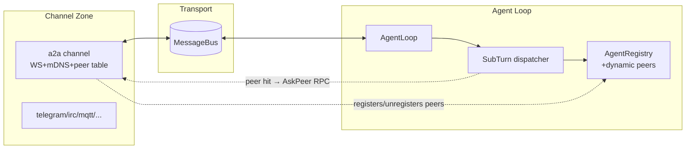

# §1 — A2A Channel 整體架構與檔案佈局

> 系列: PicoClaw A2A (Agent-to-Agent over WebSocket + mDNS) Channel Design
> 章節: 1 / 5
> 狀態: draft, awaiting approval

## 已凍結的設計約束

1. Bi-directional peer，每節點都是完整 PicoClaw
2. mDNS 啟動就持續 announce + browse + TTL reap
3. 遠端 peer 自動進 AgentRegistry 走 sub-agent 路徑
4. `maxTurn` 限制 A↔B 來回次數
5. `session_id` 由 initiator 產生，雙邊各自映射本地 session_key
6. 每節點同時是 WS server + on-demand WS client

## 模組界線

全部收在 `pkg/channels/a2a/`，不另開 zone：

```tree
pkg/channels/a2a/
├── init.go         RegisterFactory(config.ChannelA2A, …) 像 IRC/MQTT 一樣
├── a2a.go          A2AChannel struct + Start/Stop/Send (實作 channels.Channel)
├── server.go       WS server (http.Handler + nhooyr/websocket upgrader)
├── client.go       WS client pool: dial peer on-demand, reuse conn
├── discovery.go    mDNS announce + browse (TTL reap)
├── peer_table.go   peer_id → {host, port, ws_path, last_seen}; thread-safe
├── protocol.go     wire format (envelope, ask/reply/ping frames) + version
├── session_map.go  external_session_id ↔ local_session_key 雙向映射
├── ask_client.go   AskPeer(ctx, peerID, sessionID, maxTurn, question) (RPC 配對)
├── turn_counter.go per-session A↔B turn counter (兩邊都用)
├── bridge.go       注入 AgentRegistry + 動態 register/unregister peer-as-subagent
└── a2a_test.go     table tests (envelope round-trip, peer_table TTL, session_map)
```

## 在既有 zone 圖中的位置

| Zone        | 既有元件                              | A2A 加什麼                                                                                      |
| ----------- | ------------------------------------- | ----------------------------------------------------------------------------------------------- |
| Channel     | `channels.Channel` interface          | A2AChannel (新)                                                                                 |
| Transport   | `bus.MessageBus`                      | 不變 — A2AChannel 走 `PublishInbound` + `Send`                                                  |
| Agent Loop  | `AgentRegistry`, `SubTurn` dispatcher | AgentRegistry 加 `RegisterDynamic` / `UnregisterDynamic`；SubTurn dispatcher 加 hook 偵測 peer  |
| Persistence | `session.SessionStore`                | 不變 — A2A `session_id` 只活在 `session_map` (in-memory)；本地 `session_key` 仍走 jsonl backend |
| Security    | `BaseChannel.IsAllowedSender`         | 直接借用 — peer 的 `SenderInfo.CanonicalID` 設為 `a2a:peer-<id>`                                |
| Ops         | `health` / `heartbeat`                | mDNS announce 走自家 ticker，status 可掛 health                                                 |

## Config 形狀 (細節在 §4)

```yaml
channels:
    a2a:
        enabled: true
        type: a2a
        settings:
            agent_id: alice # 本機 A2A 識別 (mDNS instance name)
            port: 0 # 0 = 自動分配 (mDNS TXT 公告實際 port)
            announce_interval: 30s
            peer_ttl: 90s # 3× announce_interval
            max_turn_default: 6 # initiator 未指定時的預設
            allow_from: # 接受萬用字元 a2a:*
                - "a2a:bob"
                - "a2a:carol"
```

## 為什麼不開 `pkg/a2a/` 獨立 zone

- Channel 是 PicoClaw 既有「插件型」zone，新增 channel 不會撼動 zone 圖。
- 開 `pkg/a2a/` 會多一條 agent → a2a 依賴，破壞「Agent Loop 只依賴 Bus」這條既有規則。
- `bridge.go` 是唯一需要 reach into agent zone 的檔案 — 刻意獨立，未來若要改為事件式 (channel 發 PeerDiscovered event、agent zone 訂閱) 只動這一個檔案。

## 與既有 Zone 圖的相容性



## 下一節預告

§2 — Wire protocol、訊息形狀、`maxTurn` 計數規則 (誰算、何時遞增、超限怎麼拒絕)、framing 與版本協商。
