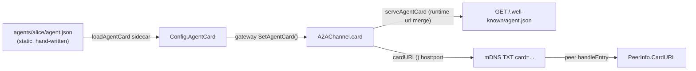

# Plan: Google A2A Agent Card 支援 (picoclaw + m-agent)

## Context (為什麼要做)

目前 picoclaw 的 A2A channel 用 mDNS TXT 的 `desc=` 廣播「能力描述」,但那其實是 `channel_list.a2a.settings.description` — 是 **channel** 的描述(`agents/alice/config.json:56`),不是 **agent** 的能力。Google A2A 協定的 `Agent Card` 才是描述 agent 身份 / 能力 / skills 的標準載體,透過 `GET /.well-known/agent.json` 取得。

本變更讓 picoclaw agent 具備 Google A2A v0.3.0 Agent Card:

1. 靜態 `agent.json` sidecar 檔(hand-written,per-agent)。
2. HTTP endpoint `GET /.well-known/agent.json`(同時 alias `/.well-known/agent-card.json` 做 forward-compat)。
3. mDNS 新增 `card=` TXT 指向該 endpoint(`desc=` 維持 channel description 不變)。

## Scope (相容性範圍)

`Card 格式 + endpoint + mDNS 廣播` **only**。picoclaw 的 task 協定(自訂 WS ask/reply + `POST /a2a/v1/ask`)**不**改成 Google JSON-RPC `tasks/send`。Card 的 `url` 指向 picoclaw 的 `/a2a/v1/ask`、`preferredTransport: "HTTP+JSON"`(最接近)。這是 **card-level compat**,非完整 protocol compat — 已知限制,留待未來。

## Confirmed decisions (已與 user 確認)

- `Skills`:靜態寫在 `agent.json`(不從 `SkillsLoader` 動態衍生,不動 frontmatter parser)。
- `mDNS`:`desc=` 維持 `cfg.Description`(channel desc);**只**新增 `card=` TXT 指向 well-known URL。

## Data flow



---

## Engine changes (picoclaw submodule)

### NEW `picoclaw/pkg/config/config_agentcard.go`
- `const AgentCardProtocolVersion = "0.3.0"`、`const AgentCardSidecarFile = "agent.json"`。
- `func agentCardPath(configPath string) string` — 完全 mirror `securityPath`(`security.go:27-30`):`filepath.Join(filepath.Dir(configPath), "agent.json")`。
- Structs(全 `json:",omitempty"`):
  - `AgentCard`:`Name, Description, Version, URL, ProtocolVersion string`;`Skills []AgentSkill`;`PreferredTransport string`;`AdditionalInterfaces []AgentInterface`;`Capabilities *AgentCapabilities`;`DefaultInputModes, DefaultOutputModes []string`;`Provider *AgentProvider`;`DocumentationURL, IconURL string`;`Authentication *AgentAuthentication`;`SupportsAuthenticatedExtendedCard bool`。
  - `AgentCapabilities`:`Streaming, PushNotifications, StateTransitionHistory bool`;`Extensions []AgentExtension`。
  - `AgentSkill`:`ID, Name, Description string`(req);`Tags, Examples, InputModes, OutputModes []string`;`SecuritySchemes map[string]AgentSecurityScheme`。
  - `AgentInterface`、`AgentProvider`、`AgentAuthentication`、`AgentSecurityScheme`、`AgentExtension`(v0.3.0 schema,見 spec)。
- `func (c *AgentCard) Validate() error`:req 欄位(`Name/Description/Version/URL/ProtocolVersion`)非空、`len(Skills)>=1`、每個 skill `ID/Name/Description` 非空。`ProtocolVersion != "0.3.0"` 只 warn 不 fail。
- `func loadAgentCard(cfg *Config, cardPath string) error`:mirror `loadSecurityConfig`(`security.go:34`)— `os.IsNotExist` → return nil(card 可缺);parse/validate 失敗 → `logger.WarnCF` 並 **set `cfg.AgentCard = nil`**(**不**讓壞檔打掛啟動)。
- `func (c *AgentCard) ApplyRuntime(host string, port int) *AgentCard`:回傳 copy,override `URL = fmt.Sprintf("http://%s:%d/a2a/v1/ask", host, port)`、強制 `ProtocolVersion = AgentCardProtocolVersion`、`PreferredTransport = "HTTP+JSON"`。serve-time 用,operator 寫的 `url` 視為提示會被覆蓋(在 `agent.example.json` 頂部註解 + struct doc 註明)。

### MODIFY `picoclaw/pkg/config/config.go`
- `Config` struct(:34-55)加 `AgentCard *AgentCard \`json:"-" yaml:"-"\``(不進 config.json,card 在獨立 sidecar)。
- `LoadConfig`(:1264)在 `loadSecurityConfig` 區塊(:1474-1478)之後插入:`cardPath := agentCardPath(path); if err := loadAgentCard(cfg, cardPath); err != nil { return nil, err }`(loader 內部已吞非致命錯,此 `if` 為防禦)。

### MODIFY `picoclaw/pkg/channels/a2a/a2a.go`
- `A2AChannel`(:15-38)加欄位 `card *config.AgentCard`。
- 加 interface(mirror `RegistryAware` :41-43):`type CardAware interface { SetAgentCard(card *config.AgentCard) }`。
- 加 method(mirror `SetAgentRegistry` :80-84):`func (c *A2AChannel) SetAgentCard(card *config.AgentCard) { c.card = card }`。

### MODIFY `picoclaw/pkg/channels/a2a/server.go`
- `newWSServer` mux(:49-55)加兩條 route(WS upgrade 前註冊,路徑不衝突):
  `mux.HandleFunc("/.well-known/agent.json", s.serveAgentCard)` 與 `/.well-known/agent-card.json`。
- 新 handler `serveAgentCard(w, r)`:
  - 非 GET → 405。
  - `s.ch.card == nil` → 404。
  - `host`:重用 `advertiseIPs(s.ch.cfg.BindAddr)`(`discovery.go:229`)取 `[0]`,空則 `localhost`。
  - `card.ApplyRuntime(host, s.ch.port)` → `json.MarshalIndent` → 200,`Content-Type: application/json; charset=utf-8`。
  - 成功 GET 不逐筆 log(避免 spam);可首次 serve log 一行。

### MODIFY `picoclaw/pkg/channels/a2a/discovery.go`
- `Start()` TXT(:35-40)append `"card=" + d.cardURL()`。
- 新 method `func (d *discovery) cardURL() string`:`ips := advertiseIPs(d.ch.cfg.BindAddr); host := "localhost"; if len(ips)>0 { host=ips[0].String() }; return fmt.Sprintf("http://%s:%d/.well-known/agent.json", host, d.ch.port)`。
  - **always emit**(即使 `card==nil`,與 `path/agent/desc` 一致對稱;peer GET 到 404 是合法信號)。
  - 時序安全:`discovery.Start()` 在 `server.Start()`(resolve port at `server.go:65`)之後才跑(`a2a.go:92-105`),`d.ch.port` 已是實際 port。
- `handleEntry`(:154-202)解析 `card=` TXT → `peer.CardURL`。

### MODIFY `picoclaw/pkg/channels/a2a/peer_table.go`
- `PeerInfo`(:9-17)加 `CardURL string \`json:"card_url,omitempty"\``。
- `Upsert`(:36-56)known 分支加 `existing.CardURL = p.CardURL`。

### MODIFY `picoclaw/pkg/gateway/gateway.go`
- 兩處 channel injection loop 各加一個 type assertion + call(完全 mirror 既有 `SetAgentRegistry`):
  - startup:`gateway.go:429-436`
  - reload:`gateway.go:681-688`(reload 會重建 channel,新 channel `card==nil` 直到此 loop 跑,**必須**在 reload loop 也注入)。
  - `cfg` 在兩處皆 in scope。

### NEW `picoclaw/config/agent.example.json`
- 最小合法 v0.3.0 card(all req + 1 skill),role 同 `config.example.json`(schema demo + 作為 per-agent 模板來源)。頂部放 `_comment` 說明 `url` 會被 runtime override。

### NEW tests
- `picoclaw/pkg/config/config_agentcard_test.go`:round-trip marshal/unmarshal;`Validate` happy + 各缺 req 欄位;`ApplyRuntime` assert URL/protocolVersion 被改;`loadAgentCard` 對 missing/malformed/valid path 三種行為。
- `picoclaw/pkg/channels/a2a/` 既有或新 test:`serveAgentCard` GET 200 + content-type + body(`url`/`protocolVersion` 被 override)、alias 路徑、POST 405、`card==nil` 404;`discovery` TXT `card=` 存在;`handleEntry` 解析 `card=` 進 `PeerInfo.CardURL`;`Upsert` 保留 `CardURL`。

---

## Distribution changes (m-agent superproject)

### MODIFY `scripts/a2a-test/gen-configs.py`
- 加 `DEFAULT_AGENT_CARD_SRC = REPO_ROOT / "picoclaw" / "config" / "agent.example.json"`。
- `seed()`(現有 `shutil.copy(config_src, agent_dir/"config.json")` 之後)加:若 `DEFAULT_AGENT_CARD_SRC.exists()` 則 `shutil.copy(..., agent_dir/"agent.json")`,否則 warn。
- 既有 broken-source 問題(`DEFAULT_CONFIG_SRC = picoclaw/config/config.a2a.json` 該檔已不存在,script 目前會 `sys.exit(1)`)— **不在本 plan scope**,但 PR 要註明。

### NO CHANGE
- `docker/docker-compose.agent.yml`:`../agents/alice:/root/.picoclaw`(:101)、`../agents/bob:/root/.picoclaw`(:126)為整目錄 bind mount,`agent.json` 自動落地。無需新 mount/env。
- `docker/entrypoint-agent.sh`:`LoadConfig` 以 `filepath.Dir(PICOCLAW_CONFIG)` 找 sidecar,`agent.json` 緊鄰 `config.json` 自動被找到。
- `m-agent/config.json`:line 55 `description` 是 channel desc,維持不變;card 的 description 来自 `agent.json`。
- `agents/<name>/agent.json`:per-agent、hand-edited、gitignored(由 gen-configs.py 從 example 建立)。

---

## Reuse (existing patterns to mirror, with paths)

| 用途 | 既有 pattern | 路徑 |
| --- | --- | --- |
| sidecar 載入 | `securityPath` / `loadSecurityConfig`(IsNotExist 吞掉) | `pkg/config/security.go:27-34`,hook at `config.go:1474-1478` |
| channel 注入 | `RegistryAware` + `SetAgentRegistry`,gateway 兩處 type assertion | `a2a.go:41,80-84`;`gateway.go:429-436,681-688` |
| HTTP mux 註冊 | `mux.HandleFunc` | `server.go:49-55` |
| 廣播 host | `advertiseIPs(cfg.BindAddr)` | `discovery.go:229` |
| TXT 建構/解析 | txts slice / `handleEntry` InfoFields | `discovery.go:35-40,154-202` |

---

## Verification (end-to-end)

1. `cd picoclaw && go build ./... && go test ./pkg/config/... ./pkg/channels/a2a/...` — 新測全綠、既有測不退化。
2. 手動 unit:`go test -run 'TestAgentCard|TestServeAgentCard|TestDiscoveryCard' ./pkg/config/... ./pkg/channels/a2a/...`。
3. Docker e2e:
   ```bash
   scripts/a2a-test/gen-configs.py   # 產生 agents/alice/agent.json + agents/bob/agent.json
   docker compose -f docker/docker-compose.agent.yml --profile a2a up -d --build
   curl -s http://localhost:18791/.well-known/agent.json | jq .
   # 期望:name/description/version/skills[] 齊全;url=http://<host>:18791/a2a/v1/ask;protocolVersion=0.3.0
   curl -s -o /dev/null -w "%{http_code}\n" http://localhost:18792/.well-known/agent-card.json  # 200 (alias)
   curl -s -X POST http://localhost:18791/.well-known/agent.json   # 405
   ```
4. mDNS:`dns-sd -B _picoclaw-a2a._tcp` 或既有 `scripts/a2a-test/run-test1.sh`,確認 TXT 含 `card=http://.../.well-known/agent.json`;alice/bob 仍互相發現。
5. 無 `agent.json` 的 agent:`GET /.well-known/agent.json` 回 404;`desc=` TXT 不變;既有行為不退化。

---

## Submodule workflow (PR 註明,未經指示不執行 commit/push)

1. 在 `picoclaw/` 內 edit/commit/push 到 `origin`(bizshuk fork)。
2. 回 m-agent `git add picoclaw` bump submodule pointer。
3. 跑上述 Verification。
- 引擎變更走 submodule,不在本層直接編輯 `picoclaw/**`(CLAUDE.md 慣例)。

---

## Risks / edge cases (重點)

- `url` 在 `agent.json` 寫死也會被 `ApplyRuntime` 覆蓋 → 須在 `agent.example.json` 與 struct doc 註明,避免 operator 困惑。
- 壞 `agent.json`:啟動 **silently ignore**(WARN log,`cfg.AgentCard=nil`),不打掛 agent;`GET` 回 404。**不**支援 hot-reload 改 `agent.json`(須重啟,`ReloadAgentCard` 為 future work)。
- `advertiseIPs` 回 0 IP:`cardURL()` fallback `localhost`,card 仍自洽(該情境 mDNS 本就無可用 peer)。
- port 0:`server.go:65` resolve 實際 port;`cardURL()`/`serveAgentCard` 於 `Start()` 後讀 `s.ch.port`,時序正確。
- 向後相容:無 `agent.json` → 所有 card 路徑 short-circuit,mDNS 仍 emit `card=`(404-fetchable),既有行為不變。
- mDNS TXT size:多一條 ~80 byte `card=` 遠低於 255 byte/string 限制,無虞。
- reload loop(`gateway.go:681-688`)**必須**也呼叫 `SetAgentCard`,否則 reload 後新 channel `card==nil`。
